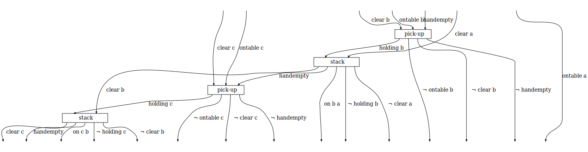

# String Diagrams For PDDL

This contains the code accompanying the talk "A Graphical, Model-Based Representation for PDDL using Category Theory" given during [ICAPS XAIP Workshop 2021](http://xaip.mybluemix.net/#/).

[String diagrams](https://arxiv.org/pdf/0908.3347v1.pdf) are a graphical language used to describe symmetric monoidal categories (SMCs) from category theory. They can be seen as mathematical rigorous expressions to describe processes and their dependencies. In this notebook, we use string diagrams to express the solutions to [Planning Domain Definition Language (PDDL)](https://www.cs.toronto.edu/~sheila/2542/s14/A1/introtopddl2.pdf) problems. More specifically, we seek to observe if the string diagram representation can elucidate interesting properties of robot manipulator program plans in a manufacturing work cell. This code uses the WiringDiagram [Catlab](https://epatters.github.io/Catlab.jl/latest/) Julia library to construct the string diagrams. In these examples, the objects are considered to be Boolean expressions and the arrows, or morphisms, are the PDDL actions.

The software requirements include:
- Julia 1.3.1
- Catlab 0.5.3
- Your OS requirements for Latex

